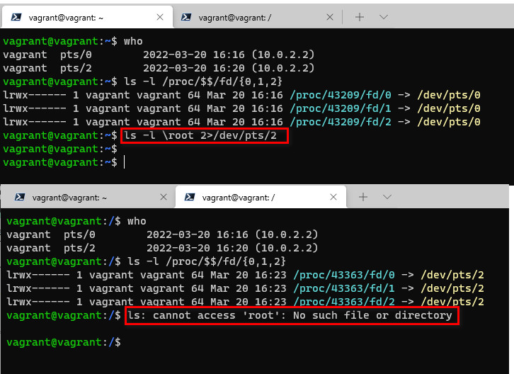
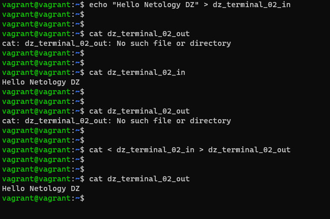
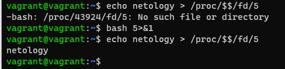
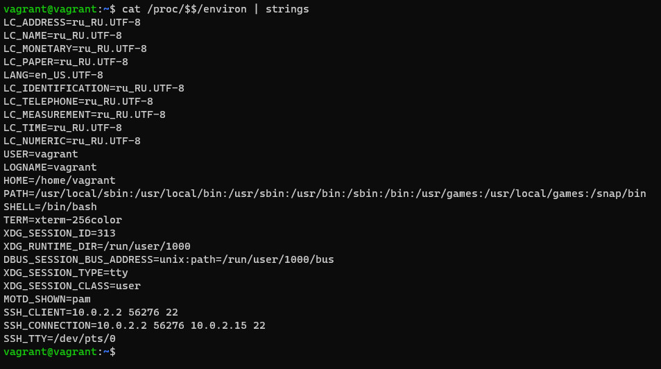
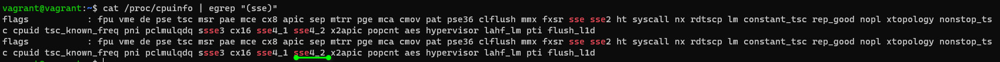

# DevOps-Netology  

## ДЗ "3.2. Работа в терминале, лекция 2"  

1.  #  
    :~$ cd - встроенная в bash команда.  
        Мне кажется она именно такого типа, поскольку её логика именно в том, чтобы работать непосредственно в оболочке в которой запущена, (меняет текущую директорию внутри окружения / запущенного shell). Её нет в файловой системе.

2.  #   
    .jpg)  

3.  #  
    Это процесс - systemd(1)    
    .jpg)  

4.  #   
    :~$ ls -l \root 2>/dev/pts/2  
      
    
5.  #  
      
6.  #  
7.  #  
    если вы выполнить :~$ echo netology > /proc/$$/fd/5  - вернёт ошибку "-bash: /proc/43924/fd/5: No such file or directory"  
    после выполнения  :~$ bash 5>&1 - отобразит echo вывод, поскольку будет создан дескриптор '5' и направит его в stdout  
      
8.  #  
9.  #  
    Выводит все переменные окружения, с которыми работает процесс.  
      
    Аналогично можно использовать - :~$ env  

10. #  
    в /proc/<PID>/cmdline - хранится командная строка, которой был запущен данный процесс;  
    /proc/<PID>/exe - представляет собой символическую ссылку на исполняемый файл, который инициировал запуск процесса;
11. #  
    Ответ - SSE 4.2  
    :~$ cat /proc/cpuinfo | egrep "(sse)"  
     
12. #  
13. #  
14. #  
