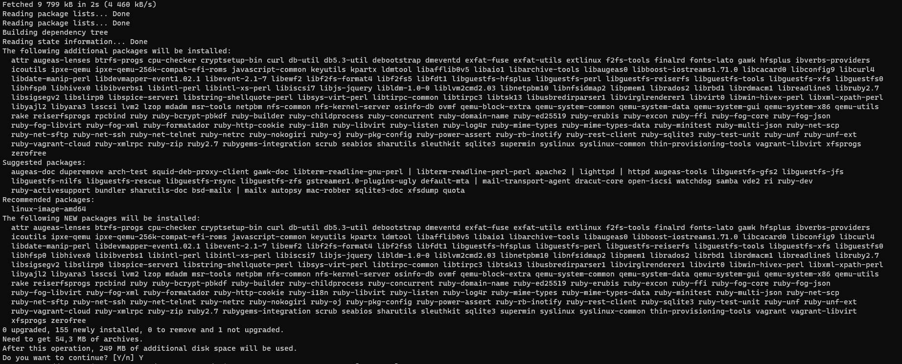
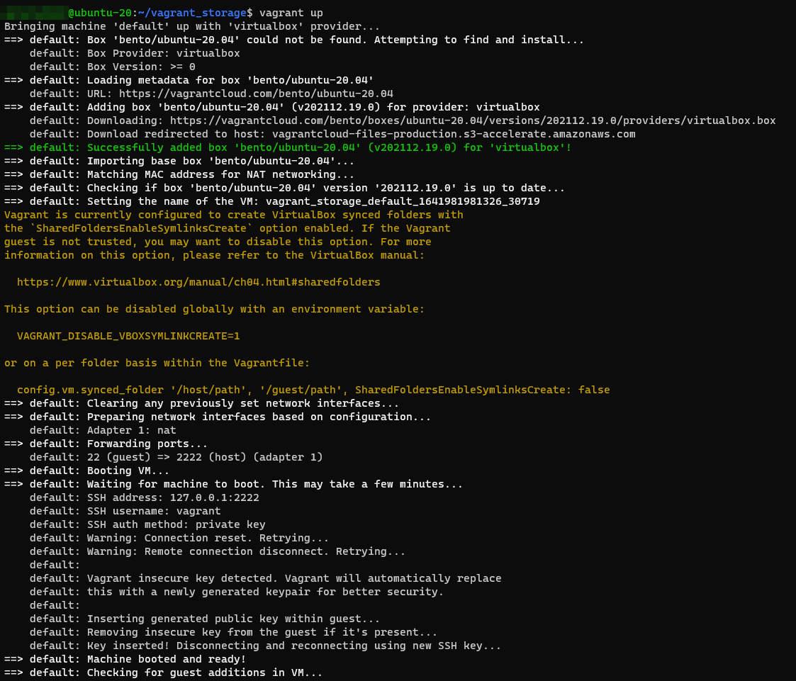
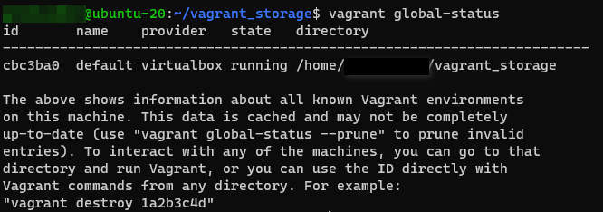
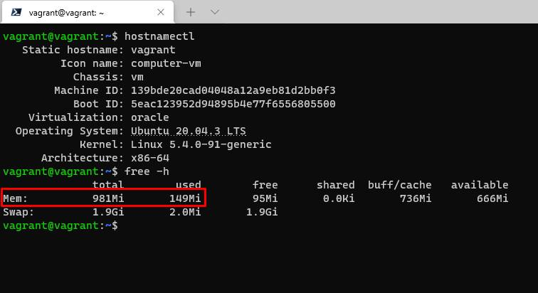
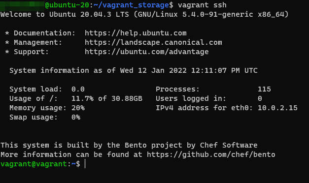

# devops-netology

# ДЗ "3.1. Работа в терминале, лекция 1"

1)  sudo apt-get install virtualbox  
***  
2)  sudo apt-get update && sudo apt-get install vagrant  
      
***   
3)  Использую Linux Ubuntu  
***  
4)  mkdir vagrant_storage  
    $ cd vagrant_storage/  
    $ vagrant init  
    $ vagrant up  
           
       
  
5)  По умолчанию для новой виртуальной машины было выделено 1Gb RAM  
      
  
6)  Добавить ресурсы можно путём редактирования файла Vagrantfile  
         >   # объем оперативной памяти  
         >   vb.memory = 2048  
         >   # количество ядер процессора  
         >   vb.cpus = 1  
  
7)    
8)  HISTSIZE - запоминаемое кол-во команд в списке истории;  
    HISTFILESIZE — максимальное количество строк, содержащееся в файле истории.  
        *The shell sets the default value to 500 after reading any startup files. (Manual page bash(1) line 641/3452)*  
    ignoreboth - объединяет 2 комманды:  
        >   ignorespace - не сохранять строки начинающиеся с пробельного символа  
        >   ignoredups  - не сохраняет совпадающие с последней выполненной командой строки  

9)  {} - зарезервированные слова, список команд, простой список.  
            { list; }   -   Manual page bash(1) line 207/3461 6%  
        
            That command is usually a list of commands between { and }, but may be any command listed under... - Manual page bash(1) line 312/3461 10%  
            
10) ...

11) ...

12) ...

13) ...

14) ...

