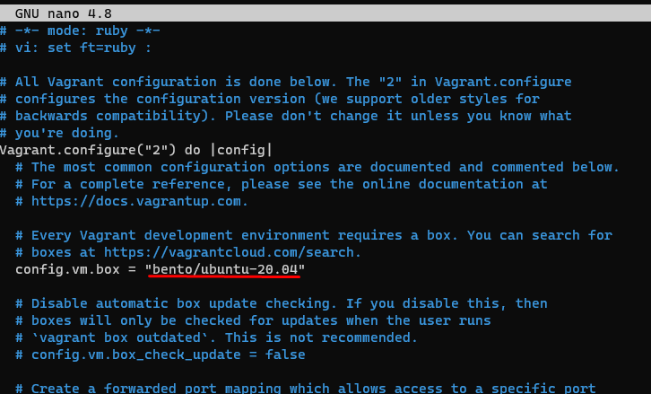
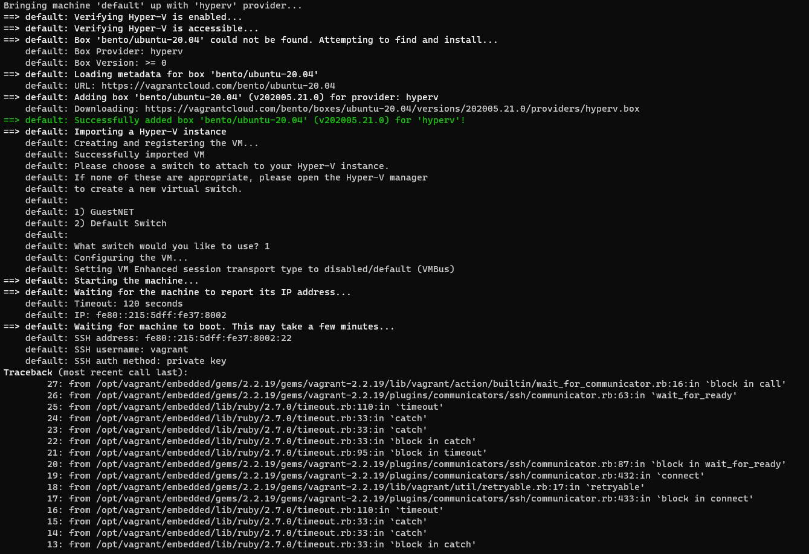
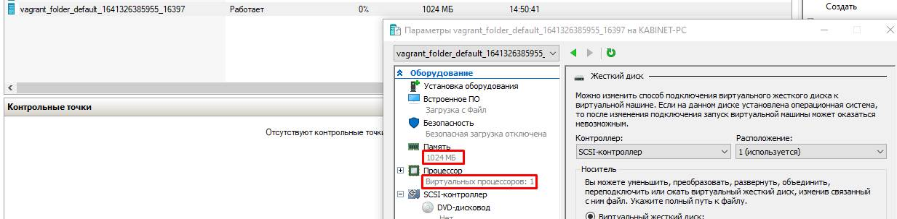

# devops-netology

# ДЗ "3.1. Работа в терминале, лекция 1"

1)  Используется Hyper-V  
***
2)  sudo apt-key adv --recv-keys --keyserver keyserver.ubuntu.com DA418C88A3219F7B  
    sudo apt-add-repository "deb [arch=amd64] https://apt.releases.hashicorp.com $(lsb_release -cs) main"  
    sudo apt-get update && sudo apt-get install vagrant  
***   
3)  пользуюсь Windows Terminal  
***
4)  mkdir vagrant_folder  
    $ cd vagrant_folder/  
    $ vagrant init hashicorp/bionic64  
    >    Vagrant failed to initialize at a very early stage:  
    >    Vagrant is unable to use the VirtualBox provider from the Windows Subsystem for  
    >    Linux without access to the Windows environment. Enabling this access must be  
    >    done with caution and an understanding of the implications.  
        
    $ export VAGRANT_WSL_ENABLE_WINDOWS_ACCESS="1"  
    $ vagrant init hashicorp/bionic64  
     >   A `Vagrantfile` has been placed in this directory. You are now  
     >   ready to `vagrant up` your first virtual environment!  
      
     

5)  
